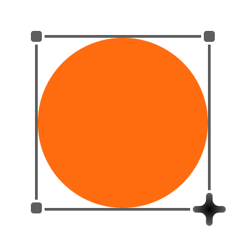

<!-- Improved compatibility of back to top link: See: https://github.com/othneildrew/Best-README-Template/pull/73 -->

<!--
*** Thanks for checking out the Best-README-Template. If you have a suggestion
*** that would make this better, please fork the repo and create a pull request
*** or simply open an issue with the tag "enhancement".
*** Don't forget to give the project a star!
*** Thanks again! Now go create something AMAZING! :D
-->

<!-- PROJECT LOGO -->
 

  <!--  -->

  <h3 align="center">UI Interviewer</h3>

  

    The First Structured Interview Prep Platform foro UI/UX Designers.
     
    
  

<!-- ABOUT THE PROJECT -->
## About The Project

[![Product Name Screen Shot][product-screenshot]](https://example.com)
There are many interview prep resources for software engineers out there on the web—the most notorious being LeetCode; however, while software engineers can practice active recall for technical interiviews doing DSA problems, there is no real way to practice retrieval of UI/UX design principles in preperation for design interviews. So we decided to make it. The First Structured Interview Prep Platform for UI/UX Design.

Here are the planned features:
* Generate UI/UX interview practice problems
* Draw diagrams for the given problem using Excalidraw
* Have a conversation with an AI interviewer real-time about constraints and the general deisgn process
* Receive rubric based scoring that evaluates user transcripts, diagramming, and task/constraint alignment
* View stats on probelms solves, daily activity, etc.

We are still early in the development process and are currently focused on flushing out the main MVP. More features will surface as we go through development which wil be queued for after the MVP is complete.

(<a href="#readme-top">back to top</a>)

### Built With

The application is hosted on Vercel and built with Next.js (React). Authentication and identity management are handled by AWS Cognito, with DynamoDB and S3 used for user data storage.

* [![Vercel][Vercel]][Vercel-url]
* [![React][React.js]][React-url]
* [![Next][Next.js]][Next-url]

* [![AWS][AWS]][AWS-url]
* [![ChatGPT][Gpt]][Gpt-url]

(<a href="#readme-top">back to top</a>)

### System Architecture
TODO

(<a href="#readme-top">back to top</a>)

<!-- ROADMAP -->
## Roadmap
**Development**
- [ ] Add real-time AI interviewer
- [ ] Finish frontend for settings page
- [ ] Design/Implement landing page

**Documentation**
- [ ] Add Changelog
- [ ] Populate Github Issues
- [ ] Add system architecture to README

See the [open issues](https://github.com/othneildrew/Best-README-Template/issues) for a full list of upcoming features.

(<a href="#readme-top">back to top</a>)

<!-- CONTACT -->
## Contact

Justin Zhao - [LinkedIn](https://www.linkedin.com/in/justinzhao1/) - justinzhao1324@gmail.com

Junheng Zheng - [LinkedIn](https://www.linkedin.com/in/junhengzheng/) - jz7259@g.rit.edu

Project Link: [To be added]()

(<a href="#readme-top">back to top</a>)

<!-- MARKDOWN LINKS & IMAGES -->
<!-- https://www.markdownguide.org/basic-syntax/#reference-style-links -->

[product-screenshot]: images/screenshot.png
[Gpt]: https://img.shields.io/badge/ChatGPT-74aa9c?logo=openai&style=for-the-badge&logoColor=white
[Gpt-url]: https://chatgpt.com
[Vercel]: https://img.shields.io/badge/Vercel-%23000000.svg?logo=vercel&style=for-the-badge&logoColor=white
[Vercel-url]: https://vercel.com
[Next.js]: https://img.shields.io/badge/next.js-000000?style=for-the-badge&logo=nextdotjs&logoColor=white
[Next-url]: https://nextjs.org/
[React.js]: https://img.shields.io/badge/React-20232A?style=for-the-badge&logo=react&logoColor=61DAFB
[React-url]: https://reactjs.org/
[Vue.js]: https://img.shields.io/badge/Vue.js-35495E?style=for-the-badge&logo=vuedotjs&logoColor=4FC08D
[AWS]: https://custom-icon-badges.demolab.com/badge/AWS-%23FF9900.svg?logo=aws&style=for-the-badge&logoColor=white
[AWS-url]: https://aws.amazon.com/